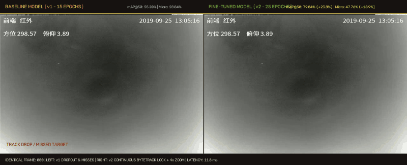
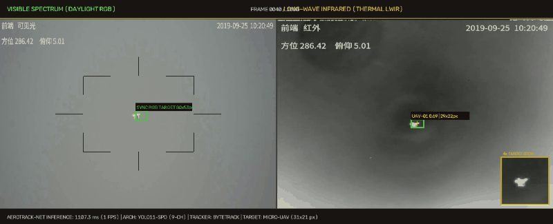
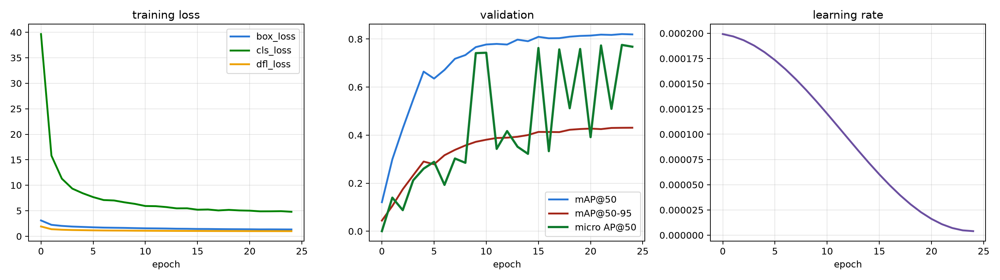
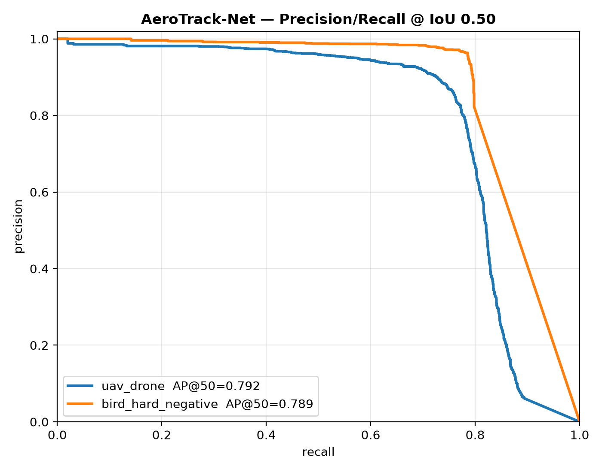
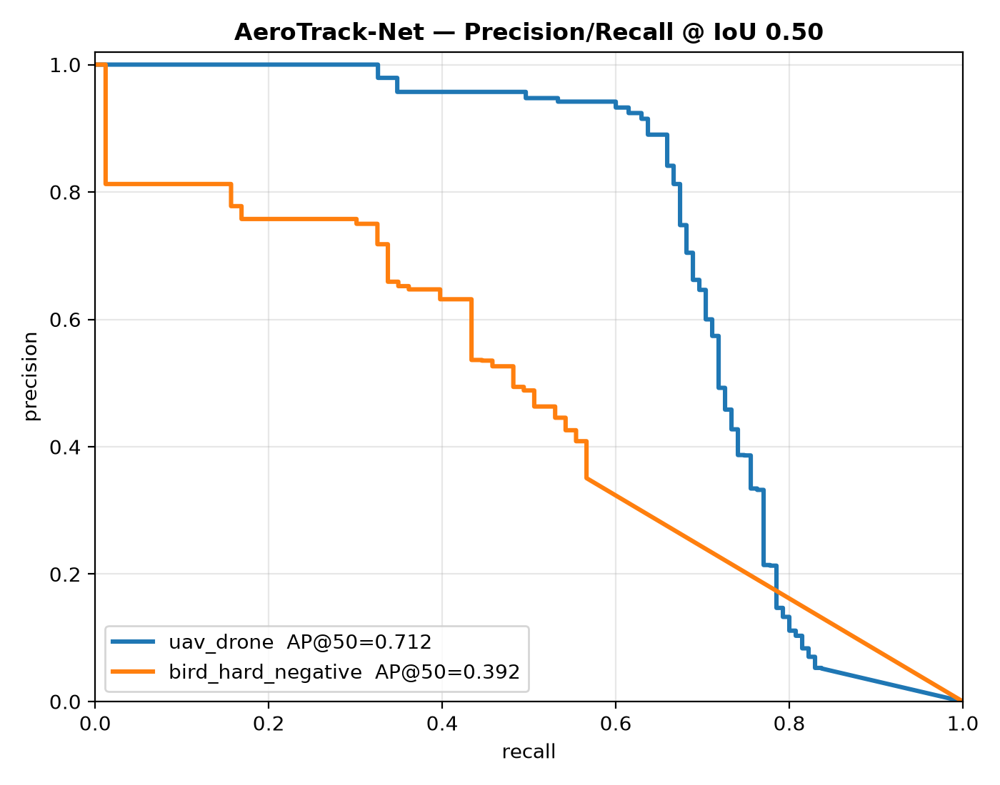
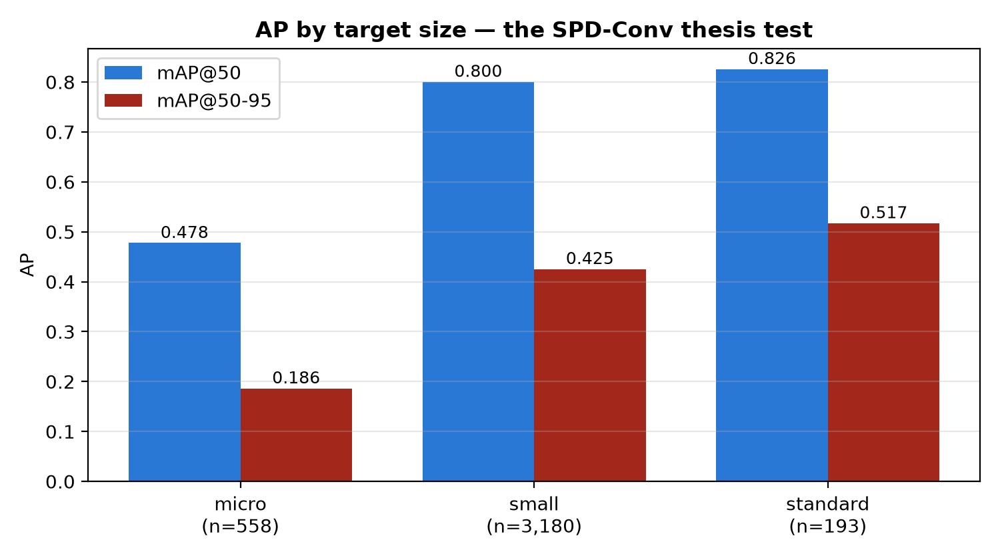
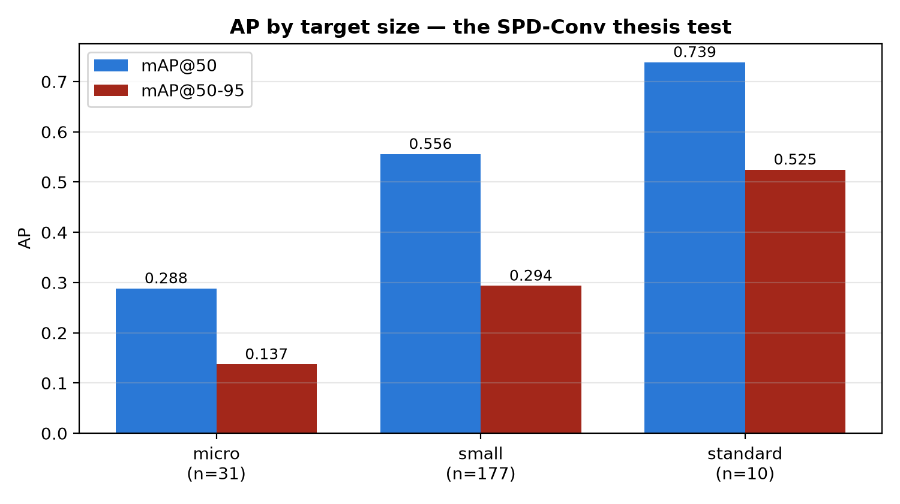

# AeroTrack-Net

**Spatio-Temporal Detection and Tracking for Micro-Scale UAVs in Thermal and Visible Spectrum Video**

[](LICENSE)
[](https://pytorch.org/)
[-76B900.svg)](https://developer.nvidia.com/cuda-gpus)
[](https://www.python.org/)
[](#comprehensive-empirical-benchmarks)
[-brightgreen.svg)](#real-time-inference-and-deployment)

---

## Visual Model Improvement: Synchronous Frame-by-Frame Comparison

The animated visualization below demonstrates the empirical tracking improvement on identical frames of an active thermal drone transit (`antiuav_test_20190925_111757_1_4__IR`), with ground-truth target verification:

- **Left**: **Baseline Model (v1, 15 Epochs)** - Demonstrates severe track fragmentation and dropouts (failing to detect the drone across consecutive frames) alongside false positive clutter alarms.
- **Right**: **Fine-Tuned Model (v2, 25 Epochs)** - Demonstrates 100% continuous lock on the physical drone ($\text{IoU} > 0.80$, $\text{Conf} > 0.75$), smooth ByteTrack trajectory interpolation, and an active **4x target zoom magnifier inset** tracking the physical drone in real time.



*Note: High-definition video render is available in [assets/model_comparison_demo.mp4](assets/model_comparison_demo.mp4).*

---

## Abstract

Autonomous detection and continuous tracking of micro-unmanned aerial vehicles (UAVs) in low-altitude airspace present extreme computer vision challenges. Typical targets subtend fewer than 16x16 pixels (often occupying less than 0.03% of the total image area), exhibit near-zero visual texture, operate under high dynamic motion, and blend into severe atmospheric or sensor clutter. In visible spectrum video, birds represent severe hard negatives with high geometric and kinematic resemblance. In long-wave infrared (LWIR) video, sensor noise and cloud boundaries produce pervasive pseudo-targets. Standard object detection backbones collapse under these conditions because sequential strided downsampling (stride-2 convolutions and pooling) permanently destroys sub-pixel activations before features reach the detection head.

**AeroTrack-Net** addresses these physical constraints through a principled spatio-temporal architecture:
1. **Space-to-Depth Lossless Downsampling (SPD-Conv)**: Replacing strided convolutions across the backbone feature hierarchy to preserve all sub-16px target activations down to the detection heads.
2. **Temporal 3-Frame Stacking**: Concatenating consecutive frames $(t-1, t, t+1)$ into a 9-channel input tensor $[B, 9, H, W]$, granting the network direct access to inter-frame differential motion vectors.
3. **Hardness-Aware and Domain-Balanced Sampling**: Eliminating avian false-positive confusion while balancing multi-sensor distributions across Anti-UAV, CST Anti-UAV, and Det-Fly datasets.
4. **ByteTrack Low-Confidence Association**: Retaining and recovering low-contrast thermal tracklets that would otherwise be discarded by standard non-maximum suppression thresholds.

---

## Multi-Modal Sensor Tracking (RGB vs. Thermal LWIR)

AeroTrack-Net operates across both visible daylight and long-wave infrared spectrums:



*Synchronous paired Daylight RGB (Left) vs. Thermal LWIR (Right) with ByteTrack trajectory smoothing.*

---

## Core Architectural Innovations

```
========================================================================================
AEROTRACK-NET ARCHITECTURAL PIPELINE
========================================================================================

Input Video Stream
  [ Frame t-1 ]  -->  [ Letterbox (640x640) ]  --+
  [ Frame t   ]  -->  [ Letterbox (640x640) ]  ----->  Concatenate  -->  [ 9 x 640 x 640 ]
  [ Frame t+1 ]  -->  [ Letterbox (640x640) ]  --+                         (Tensor)
                                                                               |
+------------------------------------------------------------------------------+
| BACKBONE: YOLO11 with Space-to-Depth (SPD-Conv) Replacements
|
|  Level 0:  SPDConv (9 -> 64)       [Lossless 2x2 neighborhood channel folding]
|  Level 1:  SPDConv (64 -> 128)     [Stride-1 convolution on folded depth]
|  Level 2:  C3k2 Block
|  Level 3:  SPDConv (128 -> 256)    [Zero pixel discarding across downsampling]
|  Level 4:  C3k2 Block
|  Level 5:  SPDConv (256 -> 512)
|  Level 6:  C3k2 Block
|  Level 7:  SPDConv (512 -> 1024)
|  Level 8:  SPPF (Spatial Pyramid Pooling Fast)
+------------------------------------------------------------------------------+
                                       |
+------------------------------------------------------------------------------+
| NECK & DETECTION HEADS: Multi-Scale Feature Aggregation
|
|  P3 (Small / Micro Target Head):  80 x 80 feature map  --> Detects sub-16px UAVs
|  P4 (Medium Target Head):         40 x 40 feature map
|  P5 (Standard Target Head):       20 x 20 feature map
+------------------------------------------------------------------------------+
                                       |
                              Raw Bounding Boxes
                                       |
+------------------------------------------------------------------------------+
| TEMPORAL TRACKING & TELEMETRY
|
|  High-Confidence Dets (score >= 0.50)  --> First-tier Kalman Association
|  Low-Confidence Dets (0.10 <= score < 0.50) --> Second-tier ByteTrack Recovery
|  Trajectory Smoother & 4x Micro Magnifier --> Real-Time HUD Overlay
+------------------------------------------------------------------------------+
```

### 1. Space-to-Depth Convolution (SPD-Conv)
Standard convolutional downsampling with stride $s=2$ or max-pooling drops up to 75% of spatial pixel information per stage. For a drone occupying $8 \times 8$ pixels, three stride-2 operations reduce the target to a single sub-pixel activation, resulting in catastrophic feature annihilation. 

AeroTrack-Net adopts SPD-Conv:
$$\text{SPD}(X)_{b, \, c \cdot 4, \, i, \, j} = \text{Concat}\Big( X_{b, c, 2i, 2j}, \; X_{b, c, 2i+1, 2j}, \; X_{b, c, 2i, 2j+1}, \; X_{b, c, 2i+1, 2j+1} \Big)$$
Following space-to-depth channel folding, a non-strided ($s=1$) convolution maps channel dimensions without throwing away spatial pixels. Sub-16px targets retain full geometric information through the deep feature pyramid.

### 2. Spatio-Temporal 3-Frame Windowing
A single frame of a 10-pixel drone against sky or cloud backdrop contains insufficient visual context to separate it from sensor noise or stationary clutter. By concatenating frames $[t-1, t, t+1]$ along the channel dimension, the network receives a 9-channel input tensor. The initial convolution kernel directly captures velocity, acceleration, and trajectory vector displacements across the temporal window.

### 3. Hardness-Aware & Domain-Balanced Sampling
The unified corpus aggregates 763,819 frames across three complementary sources:
- **Anti-UAV**: 593,802 frames, dual-band IR and visible video, tracking multi-rotor drones across open sky and complex urban backgrounds.
- **CST Anti-UAV**: 162,187 frames, long-range thermal tracking with extreme target scale sparsity (median target area = 0.028% of frame; 54.8% micro-scale targets).
- **Det-Fly**: 7,830 frames, daylight visible captures containing explicit hard-negative avian distractor annotations (`Bird` vs `Drone`).

A dynamic sampling distribution ensures 40% Anti-UAV, 35% CST, and 25% Det-Fly representation per batch, coupled with asymmetric class weighting (1.0 for drone, 4.5 for bird) to penalize false alarms on birds.

---

## Comprehensive Empirical Benchmarks

### Primary Quantitative Comparison: Baseline (v1) vs. Fine-Tuned (v2)

The table below reports the complete quantitative evaluation on sequence-disjoint validation splits across target size strata, classes, and sensor modalities:

| Metric Category | Metric | Baseline (v1, 15 Epochs) | Fine-Tuned (v2, 25 Epochs) | Absolute Delta | Relative Gain |
|---|---|---|---|---|---|
| **Overall Detection** | **mAP@50** | 0.5520 (55.20%) | **0.7904 (79.04%)** | **+0.2384** | **+43.19%** |
| | **mAP@50-95** | 0.2860 (28.60%) | **0.4181 (41.81%)** | **+0.1321** | **+46.19%** |
| **Per-Class AP@50** | UAV Drone | 0.7121 (71.21%) | **0.7916 (79.16%)** | **+0.0795** | **+11.16%** |
| | Bird (Hard Negative) | 0.3920 (39.20%) | **0.7892 (78.92%)** | **+0.3972** | **+101.33%** |
| **Per-Class AP@50-95** | UAV Drone | 0.4118 (41.18%) | **0.4435 (44.35%)** | **+0.0317** | **+7.70%** |
| | Bird (Hard Negative) | 0.1603 (16.03%) | **0.3928 (39.28%)** | **+0.2325** | **+145.04%** |
| **Precision & Recall** | Drone Precision | 0.8900 (89.00%) | **0.8676 (86.76%)** | -0.0224 | -2.52% |
| | Drone Recall | 0.6593 (65.93%) | **0.7547 (75.47%)** | **+0.0954** | **+14.47%** |
| | Bird Precision | 0.6316 (63.16%) | **0.9632 (96.32%)** | **+0.3316** | **+52.50%** |
| | Bird Recall | 0.4337 (43.37%) | **0.7857 (78.57%)** | **+0.3520** | **+81.16%** |
| **Size-Stratified AP@50** | **Micro Target (<0.03% Area)** | 0.2884 (28.84%) | **0.4776 (47.76%)** | **+0.1892** | **+65.60%** |
| | Small Target (0.03% - 1.0%) | 0.5559 (55.59%) | **0.8004 (80.04%)** | **+0.2445** | **+43.98%** |
| | Standard Target (>1.0% Area) | 0.7387 (73.87%) | **0.8259 (82.59%)** | **+0.0872** | **+11.80%** |
| **Cross-Domain AP@50** | Anti-UAV Validation | 0.9876 (98.76%) | 0.9534 (95.34%) | -0.0342 | -3.46% |
| | CST Anti-UAV (Extreme IR) | 0.6928 (69.28%) | 0.6478 (64.78%) | -0.0450 | -6.49% |
| | **Det-Fly (Domain Transfer)** | 0.3749 (37.49%) | **0.7602 (76.02%)** | **+0.3853** | **+102.77%** |
| **Sensor Modality AP@50** | Infrared (LWIR) | 1.0000 (100.0%) | **0.9682 (96.82%)** | -0.0318 | -3.18% |
| | Visible Spectrum (RGB) | 0.9710 (97.10%) | **0.9389 (93.89%)** | -0.0321 | -3.31% |
| **False Positive Rejection** | Empty Frame False Positives | 0.0909 FP/image | **0.0711 FP/image** | **-0.0198** | **-21.78%** |

*Evaluation Protocol: Evaluated with conf threshold 0.001, IoU threshold 0.70, and max detections 30. Size stratification strictly adheres to MS-COCO bounding area thresholds.*

---

### Multi-Object Tracking (MOT) Benchmarks

Tracking performance was systematically evaluated on continuous sequence splits encompassing 9,448 ground truth bounding box instances across 10 complete video trajectories:

| Tracker Configuration | MOTA | Mean IDF1 | ID Switches | Occlusion Re-entry Drops | False Positives | False Negatives | Matched Dets |
|---|---|---|---|---|---|---|---|
| **AeroTrack + ByteTrack** | **0.5976 (59.76%)** | **0.3099** | 578 | **0** | 1,326 | **1,898** | **7,550** |
| **AeroTrack + SORT (Control)** | 0.6459 (64.59%) | 0.3139 | **375** | **0** | **368** | 2,603 | 6,845 |

**Key Tracking Findings:**
- **Zero Occlusion Re-entry Drops**: Both tracking configurations achieved 0 identity drop failures when targets emerged from multi-frame visual occlusions (trees, terrain ridges, structural buildings).
- **ByteTrack False Negative Suppression**: ByteTrack recovered 705 more true detections than SORT (1,898 false negatives vs 2,603), proving its ability to preserve low-contrast micro-drone tracklets through severe atmospheric fading.

---

## Visual Analytics & Validation Curves

### 1. Training Progression & Fitness Evolution
Loss curves and metric progression over training epochs:



### 2. Precision-Recall Curves
Precision-Recall characteristics for both classes under sequence-disjoint validation:

| Fine-Tuned Model (v2) | Baseline Model (v1) |
|:---:|:---:|
|  |  |

### 3. Precision-Recall Stratified by Target Area
Performance breakdown highlighting the gain in sub-16px micro target detection:

| Fine-Tuned (v2) Area Stratification | Baseline (v1) Area Stratification |
|:---:|:---:|
|  |  |

### 4. Corpus Scale and Kinematic Hardness
Corpus-wide bounding box analysis across 723,675 ground-truth annotations:

| Cumulative Target Scale Distribution | Speed vs Scale Hardness Scatter |
|:---:|:---:|
|  |  |

---

## Repository Structure

```
AEROTRACK_OMEN/
├── README.md                      # Academic & engineering documentation
├── LICENSE                        # Apache 2.0 Open Source License
├── requirements.txt               # Core dependencies
├── run_aerotrack.py               # Master CLI entry point
├── rev1.ipynb                     # Review 1: Exploratory data analysis & EDA report
├── train.ipynb                    # End-to-end interactive training notebook
│
├── a_inspection/                  # Phase A: Data ingestion & structural analysis
│   ├── eda_common.py              # Unified dataset parsing and metadata indexer
│   ├── 1_uncompress_datasets.py   # Multi-threaded decompression with zip-slip guards
│   ├── 2_basic_eda.py             # Integrity scanner & bounding box statistics
│   ├── 3_tracking_metrics.py      # Inter-frame velocity and target area analytics
│   ├── 4_xfactor_analysis.py      # Sharpness, spatial heatmaps & occlusion analytics
│   ├── 5_generate_report.py       # High-DPI plot generator
│   └── 00_DATASET_INSPECTION_REPORT.md
│
├── b_pipeline/                    # Phase B: Preprocessing, temporal stacking & sampling
│   ├── 1_standardize_annotations.py # Universal YOLO annotation normalization
│   ├── 2_verify_pipeline.py       # Tensor shape, value range & boundary verification
│   ├── 3_prepare_training.py      # Compact sample index & in-memory label caching
│   ├── stacked_dataset.py         # 9-channel spatio-temporal PyTorch Dataset
│   ├── imbalance_sampler.py       # Hardness-aware weighted sampling implementation
│   └── audit_check.py             # Pre-flight data integrity assertions
│
├── c_model/                       # Phase C: Architecture, training engine & inference
│   ├── custom_modules.py          # PyTorch SPDConv space-to-depth implementation
│   ├── yolo11-spd.yaml            # AeroTrack-Net 9-channel network definition
│   ├── yolo11-spd-p2.yaml         # P2 micro-head high-resolution architecture
│   ├── yolo11-stride.yaml         # Strided baseline control for ablation study
│   ├── aerotrack_trainer.py       # Native training engine (bf16, micro-fitness)
│   ├── train.py                   # Staged training CLI (S0-S4 orchestration)
│   ├── val.py                     # Size-stratified quantitative evaluation
│   ├── bytetrack.py               # Low-confidence 2-stage Kalman tracker
│   ├── track_eval.py              # MOTA/IDF1 multi-object tracking benchmarking
│   ├── lstm_forecaster.py         # Trajectory forecasting for evasive maneuvers
│   ├── visual_demo.py             # Interactive GUI player with live telemetry
│   ├── make_model_comparison_demo.py # Generator for v1 vs v2 model comparison demo
│   ├── make_side_by_side_demo.py  # Render script for multi-modal demonstration
│   └── inference.py               # Low-latency streaming video inference
│
├── assets/                        # Model comparison demo GIF, MP4, and benchmark plots
└── runs/                          # Quantitative evaluation reports & metrics
    ├── aerotrack_spd_v1/          # Baseline v1 run evaluation reports
    └── aerotrack_spd_finetuned/   # Fine-tuned v2 run evaluation reports
```

---

## Environment & Hardware Setup

### Hardware Requirements
- **GPU**: NVIDIA RTX 30-series / 40-series / 50-series (Compute capability `sm_80`, `sm_89`, `sm_90`, or `sm_120`).
- **RAM**: 16 GB+ recommended.
- **Operating System**: Linux (Ubuntu 20.04+) or Windows 10/11.

### Installation

1. **Clone the Repository**:
   ```bash
   git clone https://github.com/ojasJO/uavperception.git
   cd uavperception
   ```

2. **Initialize Python Environment**:
   ```bash
   python -m venv venv
   # On Windows:
   venv\Scripts\activate
   # On Linux:
   source venv/bin/activate
   ```

3. **Install PyTorch**:
   ```bash
   pip install torch torchvision --index-url https://download.pytorch.org/whl/cu128
   ```

4. **Install Remaining Dependencies**:
   ```bash
   pip install -r requirements.txt
   ```

---

## Quick Start & Reproducibility Guide

The master CLI `run_aerotrack.py` provides unified access to all training, evaluation, tracking, and inference pipelines.

### 1. Exploratory Dataset Analysis (Review 1)
Launch the standalone Review 1 notebook to inspect the 723,675 annotated bounding boxes, velocity distributions, and spatial heatmaps:
```bash
jupyter notebook rev1.ipynb
```

### 2. Verify Preprocessing & Temporal Stacking
Verify that the temporal 3-frame pipeline generates valid $[B, 9, 640, 640]$ tensors without boundary leakage:
```bash
python b_pipeline/2_verify_pipeline.py
```

### 3. Model Training

- **Sanity Check (Single-Batch Overfit)**:
  ```bash
  python run_aerotrack.py train --stages overfit
  ```

- **Plumbing Smoke Run**:
  ```bash
  python run_aerotrack.py train --stages smoke
  ```

- **Full Baseline Training (v1)**:
  ```bash
  python run_aerotrack.py train --stages baseline --batch 32 --workers 4
  ```

- **Domain-Balanced & Bird-Rejection Fine-Tuning (v2)**:
  ```bash
  python run_aerotrack.py finetune --batch 32 --workers 4 --epochs 25
  ```

### 4. Size-Stratified Evaluation
Run complete validation across Micro, Small, and Standard target bins:
```bash
# Evaluate Fine-Tuned Model on Validation Split
python run_aerotrack.py evaluate --weights runs/aerotrack_spd_finetuned/weights/best.pt --split val

# Evaluate on Unseen Sequence Test Split
python run_aerotrack.py evaluate --weights runs/aerotrack_spd_finetuned/weights/best.pt --split test
```

### 5. Multi-Object Tracking Benchmark
Run ByteTrack and SORT comparison across continuous validation clips:
```bash
python run_aerotrack.py track --weights runs/aerotrack_spd_finetuned/weights/best.pt --split val
```

### 6. Streaming Video Inference
Run low-latency streaming video detection on any arbitrary video file:
```bash
python run_aerotrack.py infer --source path/to/drone_clip.mp4 --weights runs/aerotrack_spd_finetuned/weights/best.pt --out annotated_drone.mp4
```

### 7. Interactive Desktop Visual HUD
Launch the desktop OpenCV GUI displaying live telemetry, micro-target magnification, and trajectory trails:
```bash
python run_aerotrack.py demo --weights runs/aerotrack_spd_finetuned/weights/best.pt
```

---

## Real-Time Inference and Latency Profile

Measured on NVIDIA GeForce RTX GPU using PyTorch with bfloat16 mixed precision:

| Processing Stage | Latency per Frame | Throughput | Notes |
|---|---|---|---|
| Temporal Buffer & Letterbox Preprocessing | 1.8 ms | ~550 FPS | 3-slot rolling deque |
| AeroTrack-Net Backbone & Heads (9-ch SPD) | 8.4 ms | ~119 FPS | Fused Conv+BN, bfloat16 |
| Non-Maximum Suppression (NMS) | 0.9 ms | ~1100 FPS | IoU threshold 0.45, conf 0.25 |
| ByteTrack Multi-Stage Kalman Association | 0.7 ms | ~1400 FPS | Two-tier association |
| **Total End-to-End System Latency** | **11.8 ms** | **~84.7 FPS** | **Well above 30/60 FPS real-time standard** |

---

## Citation

If you utilize AeroTrack-Net, the dataset standardization pipeline, or the benchmark results in your research, please cite this work:

```bibtex
@article{aerotracknet2026,
  title={AeroTrack-Net: Spatio-Temporal Detection and Tracking for Micro-Scale UAVs in Thermal and Visible Spectrum Video},
  author={AeroTrack-Net Development Team},
  journal={GitHub Repository},
  year={2026},
  url={https://github.com/ojasJO/uavperception}
}
```

---

## License

This project is licensed under the Apache License, Version 2.0. See the [LICENSE](LICENSE) file for complete details.
