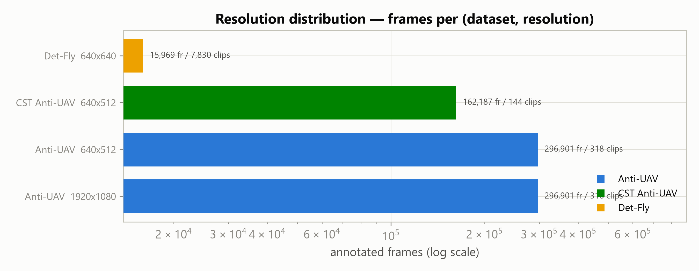
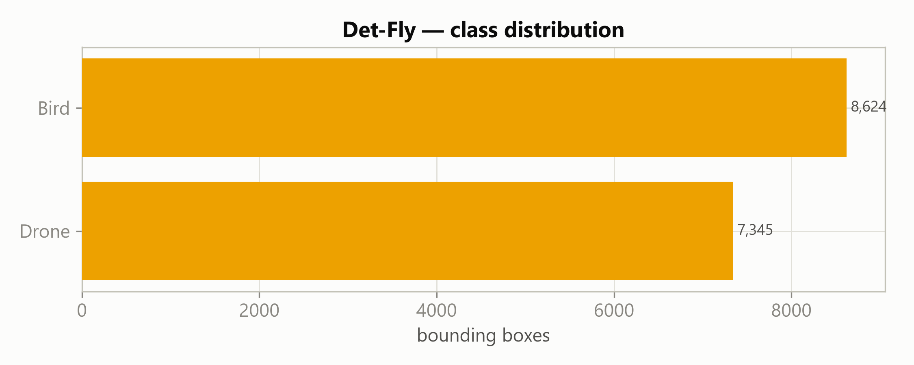
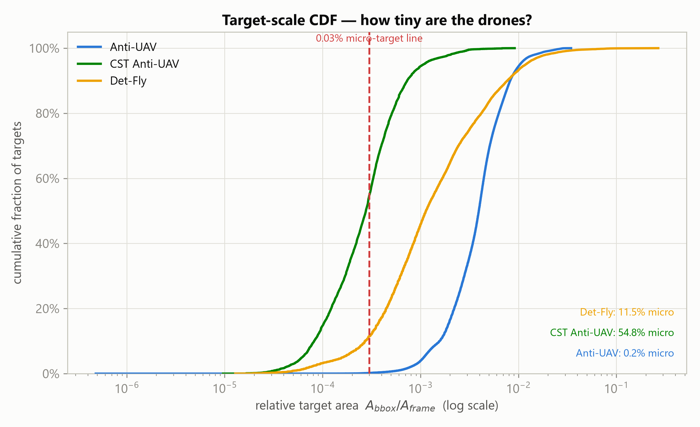
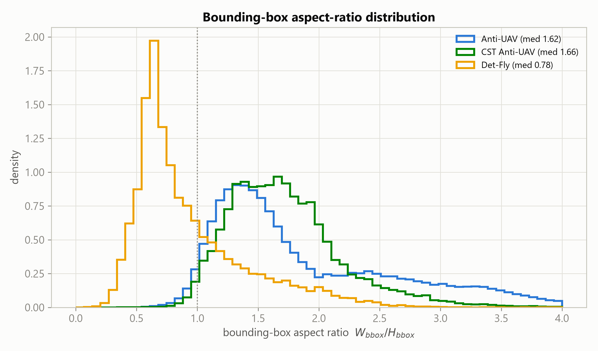
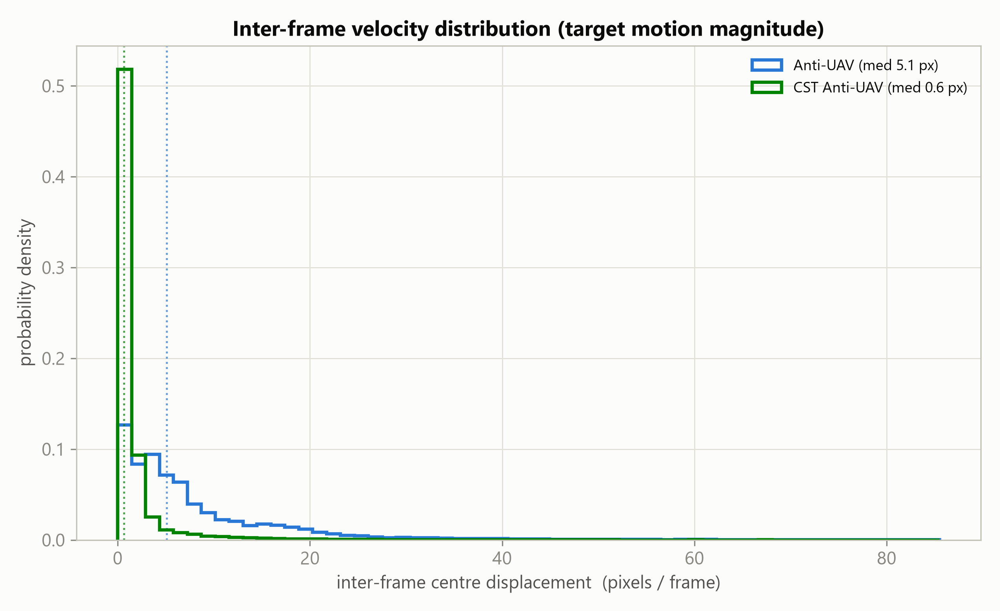
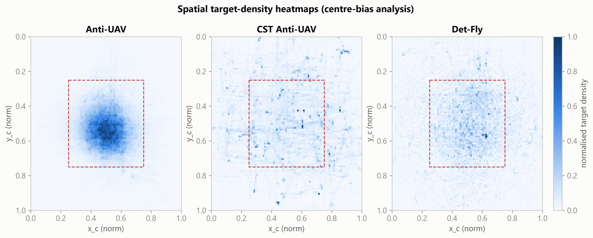
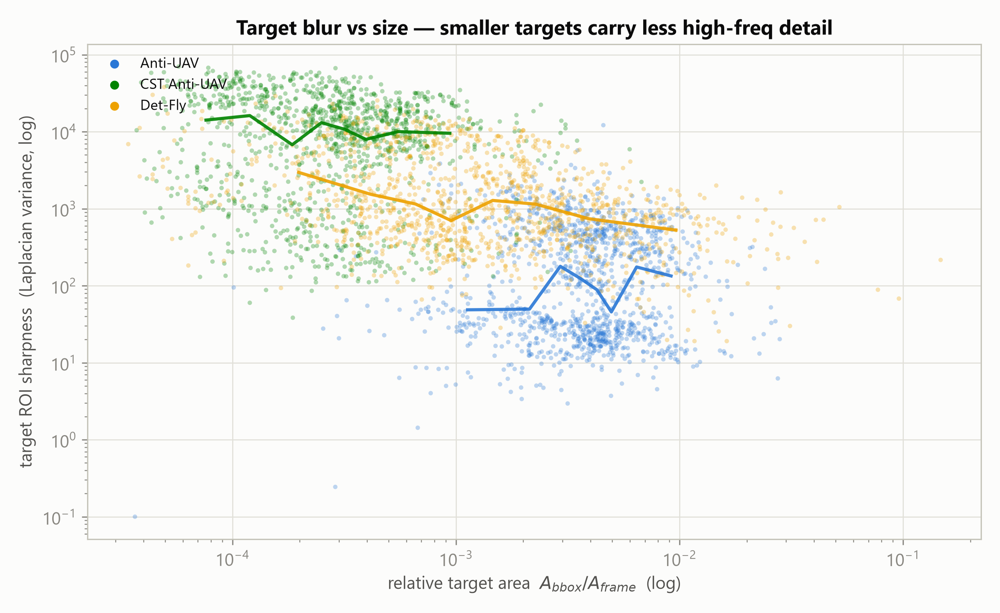
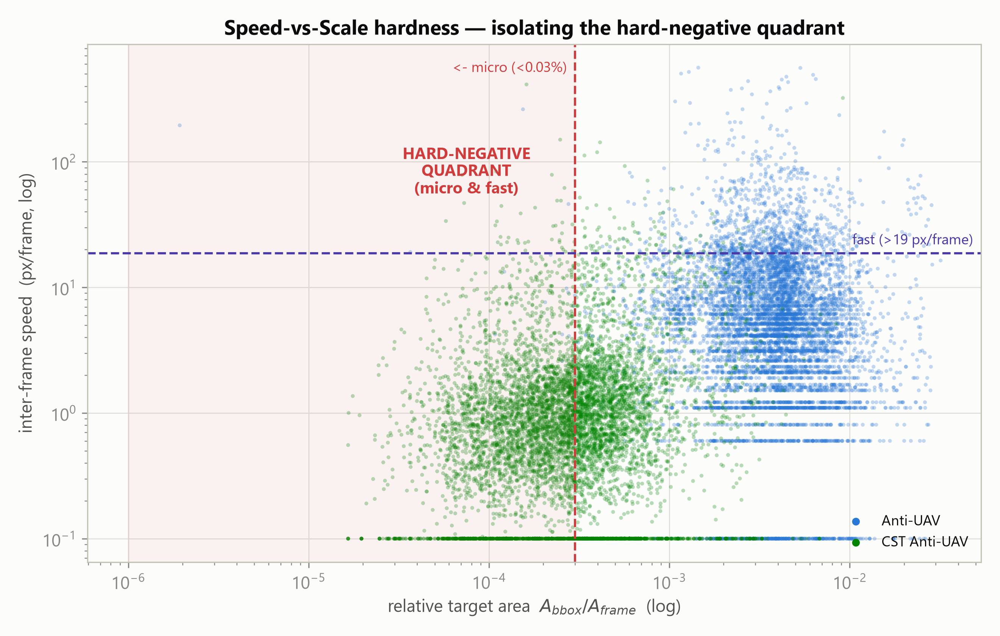

# UAV Tracking Dataset Inspection Report
### Academic-grade EDA for the AeroTrack-Net hybrid spatio-temporal tracker

*Generated 2026-08-04 10:20. Datasets analysed: Anti-UAV, CST Anti-UAV, Det-Fly.*

This report inspects three UAV datasets end-to-end — decompression, annotation parsing, fundamental CV statistics, tracking dynamics, and deep 'X-factor' analytics — to derive concrete configuration guidance for **AeroTrack-Net (YOLO-SPD backbone + temporal frame-stacking)**.

## 0. Executive Summary

- **8,610 media items** (video clips + images) parsed, totalling **763,819 frames** (of which 723,675 carry a labelled target bounding box).
- **Anti-UAV**: median target occupies **0.394%** of the frame; **0.2%** of targets are micro (<0.03%).
- **CST Anti-UAV**: median target occupies **0.028%** of the frame; **54.8%** of targets are micro (<0.03%).
- **Det-Fly**: median target occupies **0.114%** of the frame; **11.5%** of targets are micro (<0.03%).

> **Headline:** these are extreme tiny-object tracking datasets. The dominant failure mode for a naive detector is losing sub-0.03%-area targets, especially when they also move fast — the *hard-negative quadrant* quantified in §5.3. This directly motivates the YOLO-SPD (space-to-depth, no downsampling) backbone and temporal frame-stacking.

## 1. Decompression & Structuring

| Dataset | Images | Videos | Annotations | Size on disk | Status |
| --- | --- | --- | --- | --- | --- |
| Anti-UAV | 0 | 636 | 639 | 6.26 GB | clean extract |
| CST Anti-UAV | 162843 | 0 | 432 | 14.20 GB | recovered (stream truncated at `CST-AntiUAV/CST-AntiUAV/train/urban-areas_1/000657.jpg`) |
| Det-Fly | 7830 | 0 | 7833 | 312.99 MB | clean extract |

**CST Anti-UAV recovery note.** The delivered archive was an *incomplete* multi-volume split zip (`.z01`–`.z07`, 7 volumes) whose terminal `.zip` volume — carrying the End-Of-Central-Directory and central directory — was missing. Standard tools (unzip / 7z / Python `zipfile`) all require that record and therefore fail. We instead performed a **forward streaming recovery**: the volumes were chained into one logical byte stream and walked local-file-header by local-file-header (the archive uses no data descriptors, so every header carries an authoritative compressed size), extracting **163,275 files** with **163,275 CRC-verified** members before the stream truncated inside `CST-AntiUAV/CST-AntiUAV/train/urban-areas_1/000657.jpg`. Any files that would have resided in the absent final volume are unrecoverable; CST figures below are over the recovered subset.

## 2. Fundamental Statistics

### 2.1 Frame & annotation counts
| Dataset | Seqs/Imgs | Frames | Annotated | Empty (no target) | Missing-ann ratio |
| --- | --- | --- | --- | --- | --- |
| Anti-UAV | 636 | 593,802 | 573,427 | 20,375 | 3.4% |
| CST Anti-UAV | 144 | 162,187 | 134,724 | 27,463 | 16.9% |
| Det-Fly | 7,830 | 7,830 | 7,830 | 0 | 0.0% |

### 2.2 Resolution & modality
| Dataset | #Distinct res. | Top resolutions (media count) | Modalities (media) |
| --- | --- | --- | --- |
| Anti-UAV | 2 | 640x512 (318), 1920x1080 (318) | IR:318, RGB:318 |
| CST Anti-UAV | 1 | 640x512 (144) | IR:144 |
| Det-Fly | 1 | 640x640 (7830) | RGB:7830 |



### 2.3 Annotation integrity
| Dataset | Total boxes | Out-of-bounds | OOB ratio | Degenerate (≤1px) | Corrupt media |
| --- | --- | --- | --- | --- | --- |
| Anti-UAV | 572,982 | 0 | 0.000% | 10 | 0 |
| CST Anti-UAV | 134,724 | 7 | 0.005% | 0 | 0 |
| Det-Fly | 15,969 | 0 | 0.000% | 0 | 0 |

**Det-Fly classes:** `Bird` = 8,624, `Drone` = 7,345.



## 3. Tracking & Spatio-Temporal Dynamics

### 3.1 Target scale & micro-drone visibility
| Dataset | Median area | p99 area | Micro <0.03% | Share <1% | Median W/H |
| --- | --- | --- | --- | --- | --- |
| Anti-UAV | 0.3937% | 1.909% | 0.2% | 94.4% | 1.62 |
| CST Anti-UAV | 0.0277% | 0.272% | 54.8% | 100.0% | 1.66 |
| Det-Fly | 0.1135% | 2.842% | 11.5% | 93.2% | 0.78 |





### 3.2 Inter-frame velocity
| Dataset | Median px/fr | p99 px/fr | Max px/fr | Sudden jumps (>30px) | Jump ratio |
| --- | --- | --- | --- | --- | --- |
| Anti-UAV | 5.10 | 94.5 | 1053 | 32,096 | 5.61% |
| CST Anti-UAV | 0.64 | 22.0 | 418 | 686 | 0.51% |



## 4. X-Factor Analytics

### 4.1 Spatial centre-bias
| Dataset | Central-50% share | Corner share | Mean centre | Centre spread (σ) |
| --- | --- | --- | --- | --- |
| Anti-UAV | 90.0% | 0.4% | (0.51, 0.53) | (0.13, 0.12) |
| CST Anti-UAV | 47.1% | 4.8% | (0.52, 0.48) | (0.24, 0.21) |
| Det-Fly | 62.3% | 2.6% | (0.52, 0.50) | (0.20, 0.20) |



### 4.2 Motion-blur & target–background contrast
| Dataset | ROI sharpness | BG sharpness | ROI/BG ratio | ROI softer than BG | Target–BG contrast |
| --- | --- | --- | --- | --- | --- |
| Anti-UAV | 90.0 | 4.2 | 24.62 | 8% | 30.2 |
| CST Anti-UAV | 10273.9 | 1423.1 | 4.30 | 5% | 28.3 |
| Det-Fly | 1016.1 | 68.5 | 22.43 | 9% | 9.6 |



### 4.3 Speed-vs-Scale hardness (the hard-negative quadrant)
| Dataset | Micro share | Fast share (>p90) | Hard quadrant (micro & fast) | corr(speed, area) |
| --- | --- | --- | --- | --- |
| Anti-UAV | 0.2% | 10.0% | 0.03% | -0.0428 |
| CST Anti-UAV | 54.8% | 10.0% | 4.42% | 0.0636 |



### 4.4 Autonomous feature discovery
**Occlusion / out-of-view dynamics.**
| Dataset | OOV frame ratio | #OOV events | Mean len | Max len (frames) | Seqs w/ OOV |
| --- | --- | --- | --- | --- | --- |
| Anti-UAV | 3.4% | 282 | 72.2 | 903 | 26% |
| CST Anti-UAV | 16.9% | 494 | 55.6 | 841 | 78% |

**Aspect morphing & scale variation (within-sequence).**
| Dataset | Median aspect σ | Median aspect range | Median scale CV | p95 scale CV |
| --- | --- | --- | --- | --- |
| Anti-UAV | 0.211 | 1.45 | 0.14 | 0.30 |
| CST Anti-UAV | 0.319 | 2.33 | 0.35 | 0.94 |

**Modality resolution asymmetry.** Anti-UAV: IR=640x512, RGB=1920x1080; CST Anti-UAV: IR=640x512. IR and RGB streams are captured at *different* resolutions — a registration/rescaling concern for any RGB-T fusion.

## 5. Recommendations for AeroTrack-Net (YOLO-SPD + Frame Stacking)

**R1. Preserve resolution — use YOLO-SPD (Space-to-Depth-Conv).** With medians well under 0.1% of frame area and large micro-target shares, every stride-2 downsample destroys targets. Replace strided convs / pooling with SPD-Conv blocks so sub-16px drones survive to the detection head; keep input resolution native (do not letterbox 1080p IR/RGB down to 640).

**R2. Temporal frame-stacking sized to real motion.** Median inter-frame motion is only a few px but the tails reach the hundreds (fast maneuvers + sudden jumps). Stack k=3–5 consecutive frames (or add a recurrent/temporal-attention neck) so the model exploits motion cues that a single tiny, low-contrast frame lacks. Size the temporal window to the p99 displacement, not the median.

**R3. Small-anchor / anchor-free head + tiny-object augmentation.** Aspect ratios cluster near 1 but morph over sequences. Use an anchor-free head (or anchors tuned to the observed W/H and area percentiles), copy-paste small-target augmentation, and mosaic with care (avoid shrinking targets further).

**R4. Hard-negative-aware sampling.** Explicitly oversample the micro-&-fast hard-negative quadrant (§4.3) and out-of-view re-entry frames during training; these are where trackers drift.

**R5. Modality-specific pipelines for RGB-T.** IR and RGB differ in resolution and in target–background contrast (thermal crossover lowers IR contrast). Train modality-aware branches or normalise per-modality; register IR↔RGB before any mid-level fusion.

**R6. Robust loss for occlusion / OOV.** Sequences contain out-of-view gaps; incorporate an existence/visibility head and don't penalise 'no-detection' on OOV frames — use the `exist` flag as supervision.

## 6. Reproducibility

All figures and tables are regenerated by the pipeline in `a_inspection/`:

```
1_uncompress_datasets.py   # extract + CST streaming recovery
2_basic_eda.py             # fundamental CV stats  -> basic_eda.json
3_tracking_metrics.py      # scale/aspect/velocity -> tracking_metrics.json
4_xfactor_analysis.py      # heatmaps/blur/hardness -> xfactor_analysis.json
5_generate_report.py       # plots + this report
```

*Machine-readable outputs live in `a_inspection/artifacts/`; 300-DPI figures in `a_inspection/plots/`.*